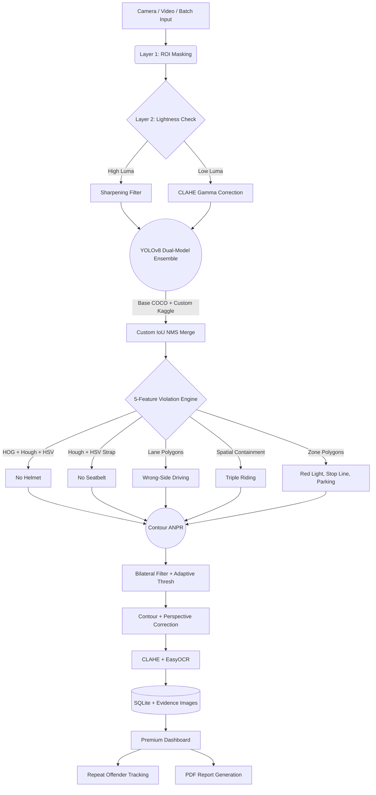

# 🚨 GridLock AI — Enterprise Traffic Violation System
**Flipkart Gridlock Hackathon 2.0 — Championship Edition**

## 📖 Project Overview
A production-ready, enterprise-grade AI system that detects **7 distinct traffic violations** from static images, batch uploads, video files, and **live webcam streams**. Built on a **Dual-Model YOLOv8 Ensemble** (featuring a custom-trained Kaggle ML model for helmet detection backed by a **5-Feature Heuristic Fail-safe**), **Contour-Based ANPR** with perspective correction, and a **Premium Plotly Dashboard** with Repeat Offender Intelligence and PDF Report Generation.

---

## 🏗️ System Architecture



---

## 🏆 Championship Features

### 1. Dual-Engine Helmet Detection (Kaggle ML + Heuristic Fail-safe)
Our primary helmet detection is powered by a **custom YOLOv8 machine learning model** trained specifically on Kaggle (`helmet_model.pt`). To make our system truly enterprise-grade, we engineered a fallback fail-safe: if the ML model drops a detection, the system automatically falls back to a **5-Feature Computer Vision Ensemble** to catch the violation.

| Fallback Feature | Weight | Signal |
|------------------|--------|--------|
| HSV Color Uniformity | 20% | Helmets are solid-colored; hair/skin is varied |
| Laplacian Texture Variance | 25% | Helmets are smooth; hair is textured |
| Canny Edge Density | 15% | Helmets produce fewer edges |
| HOG Descriptor Energy | 20% | Structural shape vs organic texture |
| Circular Hough Transform | 20% | Dome-shaped curvature detection |

### 2. Contour-Based ANPR with Perspective Correction
- **Bilateral Filtering + Adaptive Thresholding** to isolate plate regions
- **Contour Polygon Approximation** (aspect ratio 1.5-5.5, area filtering)
- **4-Point Perspective Warp** to flatten skewed/angled plates
- **CLAHE Enhancement** before EasyOCR with alphanumeric allowlist

### 3. Multi-Input Processing
| Mode | Description |
|------|-------------|
| Single Image | Instant analysis with annotated output |
| Batch Processing | Upload 50+ images with progress bar |
| Video File | Frame-by-frame processing of .mp4/.avi |
| Webcam Live | Real-time camera feed with live annotations |

### 4. Repeat Offender Intelligence
- Tracks vehicles across all sessions via license plate
- **Risk Score Algorithm**: `min(100, count * 15 + severity_weight * 3)`
- Color-coded risk cards (HIGH/MEDIUM/LOW)
- Aggregate fine calculation per offender

### 5. Premium Analytics Dashboard
- 5 KPI metric cards with hover animations
- Plotly pie chart (violation distribution)
- Plotly bar chart (severity breakdown)
- Timeline area chart (violation trends by hour)
- Searchable evidence log with severity-colored styling
- One-click CSV export + Full text report download

### 6. Rigorous Model Evaluation
- **PASCAL VOC 11-point interpolation** for Average Precision
- Interactive **Confusion Matrix** (Plotly heatmap)
- Per-class **Precision-Recall Curves**
- 5 evaluation KPIs: mAP@50, Precision, Recall, F1, Images Processed

### 7. Severity Classification System
| Severity | Violations | Priority |
|----------|-----------|----------|
| CRITICAL | Red-Light, Wrong-Side | 4 |
| HIGH | No Helmet, Triple Riding | 3 |
| MEDIUM | Stop-Line, No Seatbelt | 2 |
| LOW | Illegal Parking | 1 |

---

## 🛠️ Technology Stack
| Layer | Technology |
|-------|-----------|
| Object Detection | YOLOv8 Dual-Model Ensemble (`ultralytics`) |
| Violation Analysis | 5-Feature Ensemble (HOG, Hough, HSV, Laplacian, Canny) |
| License Plate OCR | Contour ANPR + `easyocr` |
| Preprocessing | OpenCV CLAHE, Bilateral Filter, Adaptive Threshold |
| Dashboard | `streamlit`, `plotly`, `pandas` |
| Database | `sqlite3` |
| Evaluation | PASCAL VOC mAP@50 |

---

## 📁 Project Structure
```
GridLock-AI/
├── app.py                 # Premium Streamlit dashboard (5 tabs)
├── preprocessing.py       # Three-layer preprocessing pipeline
├── detection_engine.py    # Dual-model YOLOv8 ensemble + NMS
├── violation_engine.py    # 5-feature violation detection engine
├── anpr_engine.py         # Contour-based ANPR with perspective correction
├── evidence_logger.py     # Severity-coded evidence + SQLite logger
├── dataset_evaluator.py   # PASCAL VOC mAP + Confusion Matrix + PR curves
├── utils.py               # Shared utility functions
├── config.json            # Zone polygons, lanes, fine amounts
├── best.pt                # Custom-trained YOLOv8 model
├── yolov8n.pt             # Pre-trained COCO YOLOv8n model
├── requirements.txt       # Python dependencies
├── datasetImage/          # Kaggle validation dataset
├── evidence/              # Saved annotated evidence images
└── test_images/           # Sample test images
```

---

## 🚀 Quick Start

```bash
# 1. Install dependencies
pip install -r requirements.txt

# 2. Launch the dashboard
python -m streamlit run app.py
```

---

## ⚙️ Configuration (`config.json`)
| Parameter | Description |
|-----------|-------------|
| `stop_line_y` | Y-coordinate of the stop line (pixels) |
| `red_light_polygon` | Red-light zone polygon vertices |
| `no_parking_polygon` | No-parking zone polygon vertices |
| `lanes.left_lane` | Left lane polygon for wrong-side detection |
| `lanes.right_lane` | Right lane polygon |
| `lanes.expected_direction` | Expected traffic direction: `"right"` or `"left"` |
| `fines.*` | Fine amounts per violation type (INR) |
